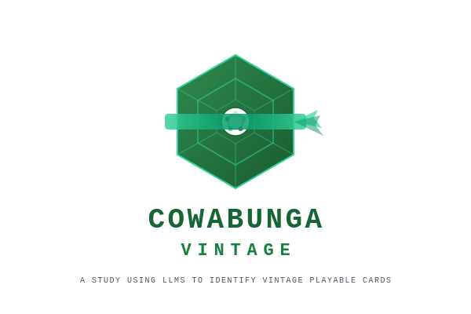

<p align="center">
  
</p>

# Cowabunga Vintage

Evaluating the Vintage playability of every card from the **Teenage Mutant Ninja Turtles** Magic: The Gathering sets using multiple LLMs.

## TL;DR

We asked three frontier LLMs (ChatGPT 5.2, Claude Opus 4.6, Gemini 3) to evaluate every card in the TMNT sets for Vintage playability. The results are poor: the models show massive disagreement with each other and fail to recognize cards that have been Vintage staples for years (Brainstorm, Sol Ring, Underworld Breach). Current general-purpose LLMs are not reliable for competitive format card evaluation.

## Why

New Magic sets keep getting larger and more frequent. I used to evaluate every single card by hand to find Vintage-playable gems, but that's no longer feasible. This project explores whether LLMs can save time by doing a first pass over an entire set and surfacing the cards worth a closer look.

## Goal

The core hypothesis is to find out whether today's top public LLMs can **concretely and effectively analyze card playability** in a competitive Magic: The Gathering format.

The TMNT Universes Beyond release introduced hundreds of new cards across multiple sets. This project feeds the complete card pool to different Large Language Models and asks each one to rate every card's competitive Vintage playability — from "very high" (likely staple) to "very low" (effectively unplayable).

We chose Vintage because it is the format we know best, but the same approach can be applied to any other format (Legacy, Modern, Pioneer, etc.). By comparing evaluations across models we can surface consensus picks, spot disagreements, and build a shortlist of cards worth testing in the format.

## Sets Covered

| Code | Set Name | Cards | Tokens |
|------|----------|------:|-------:|
| TMT  | Teenage Mutant Ninja Turtles | 320 | 10 |
| TMC  | Teenage Mutant Ninja Turtles Eternal (Commander) | 133 | 31 |
| FTMC | Teenage Mutant Ninja Turtles Eternal Front Cards | 0 | 5 |
| PZA  | Teenage Mutant Ninja Turtles Source Material | 20 | 0 |

## Data Source

`TMNT_cards.csv` was generated from [MTGJSON](https://mtgjson.com/)'s **AllPrintings.json** — the community-maintained open dataset of every Magic: The Gathering printing. The CSV contains 519 rows (cards + tokens) with fields such as name, mana cost, type, rules text, colors, keywords, rarity, and more.

`vintage_played_cards.txt` contains every card that has appeared at least once in a Vintage tournament decklist, extracted from all published MTGO Vintage tournament results. Each line lists the total number of appearances across all events followed by the card name, sorted by frequency (4,042 unique cards). This serves as a ground-truth reference for what actually sees play in the format.

## Prompt

The following prompt is used when submitting the CSV to each LLM for evaluation:

<details>
<summary>Click to expand full prompt</summary>

```
You are a Magic: The Gathering Vintage format evaluator.

Input: I will provide a CSV file where each row is one card. The CSV contains at least these fields (column names may vary): setCode, name, type/typeLine, manaCost, manaValue, colors/colorIdentity, and rules text (text/oracleText). Some rows may have missing fields.

Task: For EACH row, evaluate the card's potential playability in the Vintage format (Power 9-level environment). "Playability" here means playable in competitive Vintage (main deck or sideboard), not casual.

You must produce TWO outputs in this exact order:
1) A valid CSV (as specified below)
2) A Markdown table (as specified below)

========================
(1) CSV OUTPUT
========================
Return: Output a NEW CSV with ALL original columns preserved in the same order, plus EXACTLY TWO new columns appended at the end:

A) vintage_playability — must be one of:
   - very high
   - high
   - medium
   - low
   - very low

Scale guidance (be consistent):
- very high: likely a staple or frequently played card in competitive Vintage (main deck or very common sideboard)
- high: clearly playable in at least one established Vintage archetype and/or a common sideboard role
- medium: fringe playable; narrow meta call or niche synergy that occasionally shows up
- low: very unlikely to see competitive play; generally outclassed, too slow, too fair, or too narrow
- very low: effectively unplayable in competitive Vintage for rate/impact reasons (or only "cute"/casual use)

B) reasoning — write a short explanation (2–4 sentences) in English justifying the rating.

Requirements for reasoning:
- Mention at least one concrete Vintage concept (e.g., tempo, fast mana, blue interaction, Workshops, graveyard hate, Bazaar, artifact engines, stack interaction, sideboard hate).
- Avoid generic statements like "it's strong" or "it's good" without explaining why in Vintage terms.
- Focus on Vintage-relevant criteria: speed/efficiency, mana cost and tempo, impact on the stack, interaction, synergy with known Vintage archetypes (e.g., blue Xerox, Shops, Dredge, Breach, PO, Oath), combo potential, and sideboard relevance (hate pieces).
- If the card is likely unplayable, state why (too slow, too fair, outclassed, narrow, etc.).

IMPORTANT CSV OUTPUT RULES (MUST FOLLOW):
- CSV output MUST be plain CSV text only (include the header row). Do not wrap it in markdown fences.
- Use comma "," as the delimiter.
- Preserve ALL original columns exactly as provided (do not rename, reorder, delete, or modify them).
- Append EXACTLY two new columns at the end: vintage_playability, reasoning (no other new columns).
- The CSV must have the SAME NUMBER OF ROWS as the input, in the SAME ORDER. Do not merge, split, or drop rows.

CSV formatting/escaping:
- If a field contains commas, double quotes, or newlines, wrap the entire field in double quotes.
- Escape any double quote inside a quoted field by doubling it ( " -> "" ).
- Do NOT include literal newlines inside a field. If you need a line break, replace it with "\n" or a single space so each card remains on one CSV row.

Handling missing data:
- If information is missing for a row, make the best reasonable assumption and briefly note uncertainty in the reasoning.

Style:
- Keep reasoning concise and avoid copy-pasting the same phrasing across many rows.

========================
(2) MARKDOWN TABLE OUTPUT
========================
After the CSV, output a Markdown table with EXACTLY these columns:
- Card Name (as a clickable Markdown link to Scryfall)
- vintage_playability
- reasoning

Scryfall link requirement:
- The Card Name cell must be a Markdown link in the form: [Card Name](Scryfall URL)
- Create the Scryfall URL using a Scryfall search link that reliably finds the card by exact name, e.g.:
  https://scryfall.com/search?q=!"CARD_NAME"
  (URL-encode the card name; if setCode is available you may add set:SETCODE to narrow it.)

IMPORTANT MARKDOWN RULES:
- Output the Markdown table AFTER the CSV.
- The Markdown must be valid (pipes and alignment row).
- Escape any pipe characters "|" inside reasoning as "\|".
- Keep each table row on a single line (replace internal newlines with "\n" or spaces).
```

</details>

## Results

Each model's output is stored in its own folder with a consistent structure:

```
<model-name>/
  vintage-eval.csv   # Original card data + vintage_playability & reasoning columns
  vintage-eval.md    # Markdown table with Scryfall links, ratings, and reasoning
```

### Models evaluated so far

| Folder | Model | Provider |
|--------|-------|----------|
| `claude-opus-4.6/` | Claude Opus 4.6 | Anthropic |
| `chatgpt-5.2-thinking/` | ChatGPT 5.2 Thinking | OpenAI |
| `gemini-3-thinking/` | Gemini 3 Thinking | Google |

### Models that failed to complete the task

**Grok (xAI)** was also tested but could not complete the evaluation. Despite multiple follow-up prompts, the model consistently returned partial results and refused to provide the full output covering all 519 cards. No amount of prompt engineering or chunking was able to get Grok to generate a complete evaluation file, so it was excluded from the analysis.

### Analyses

| Analysis | Description |
|----------|-------------|
| [Cross-Model Vintage Playability Comparison](analysis-cross-model-vintage.md) | Side-by-side ratings from all three models for the 129 cards rated Medium or above by at least one LLM. Very low inter-model consensus — ChatGPT 5.2 casts a wide net (169 cards Medium+), Gemini 3 is selective but precise (16 cards), Claude Opus 4.6 is over-conservative (7 cards, none above Medium). |
| [TMNT Cards With Actual Vintage Tournament Play](analysis-vintage-played-cards.md) | Cross-references TMNT cards against real MTGO tournament data. 36 cards have actual tournament history — ChatGPT 5.2 detected 81% of them (best recall, zero critical misses), Gemini 3 was precise on top staples but missed mid-tier cards (19%), Claude Opus 4.6 failed (0% detection). |
| [ChatGPT 5.2 Consistency Analysis](analysis-chatgpt-consistency.md) | Compares two identical runs of ChatGPT 5.2 Thinking on the same input and prompt (2026-02-26 vs 2026-03-01). 50% of ratings changed between runs, with 139 downgrades and 51 upgrades. Brainstorm dropped from Very High to Low. Even cards with unchanged ratings had completely different reasoning text. The model's evaluations are not deterministic. |

## Conclusions

The level of disagreement between models was surprising. I expected some variation, but not three models producing fundamentally incompatible evaluations of the same cards. Even more concerning, current frontier LLMs fail to identify cards that have been Vintage staples for years — Brainstorm, Sol Ring, and Underworld Breach were rated "Very Low" or "Low" by at least one model. These are not edge cases; they are among the most played cards in the format's history.

General-purpose LLMs clearly lack the specialized knowledge needed for reliable Vintage card evaluation. The most promising paths forward are fine-tuning an open-weight model on Vintage-specific data (tournament results, expert commentary, gameplay analysis) or training a dedicated deep neural network from scratch on structured play statistics. Until then, LLMs can serve as a rough first filter, but they cannot replace a player who knows the format.

## Further Work

- **Evaluate more models.** Run the same prompt through additional frontier models — DeepSeek-R1, Kimi (Moonshot AI), Qwen (Alibaba) — to broaden the comparison and see if a wider panel produces more reliable consensus.
- **Fine-tune an open-weight model on Vintage data.** Take an open-weight model (e.g. Llama, Mistral, Qwen) and fine-tune it on Vintage-specific data: tournament decklists, metagame reports, card-by-card evaluations from experienced players. An additional data source could be Vintage gameplay videos and streams from YouTube/Twitch — transcribing commentary and game state analysis to generate training pairs that capture how experienced players reason about card choices in real time. A specialized model could outperform general-purpose LLMs that lack deep format knowledge.
- **Train a dedicated neural network from scratch.** Instead of adapting an LLM, build a purpose-built deep neural network trained on structured Vintage play statistics — card inclusion rates across tournaments, win-rate deltas when a card is in the deck, metagame share over time, and matchup data. A model designed around tabular card features and historical performance data could learn patterns that language-based approaches miss entirely.
- **Improve the evaluation prompt.** The current prompt is a solid first pass but could be refined — for example by providing example evaluations of known staples and unplayable cards (few-shot), supplying the current Vintage restricted list as context, or asking the model to explicitly compare each card against existing Vintage alternatives at the same mana cost.

## License

Card data sourced from [MTGJSON](https://mtgjson.com/) under their [license](https://mtgjson.com/license/).
Magic: The Gathering is a trademark of Wizards of the Coast / Hasbro. TMNT is a trademark of Paramount.
